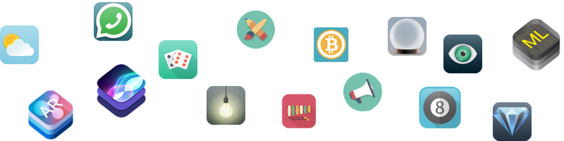

# Egg Timer ⏳

## Goal's Project 🎯

In this module it was a mix of tutorials and challenges. Most importantly, it's aim me to get comfortable with looking up how to do something I have never done before. In certain places of this module, I'll need to refere in the Xylophone module and use some Google search, StackOverflow and Apple Documentation to make my code do what I want it to. But there are also other parts where I learn through new Swift programming concepts. 

## What I create 🧱

I build an app of a beautiful egg timer app to boil your eggs to perfection depending on how you prefer your eggs. 

## What I learn 📖

* Swift Collection types - Dictionaries
* The Swift Timer API
* Conditional statements - IF/ELSE
* Conditional statements - Switch
* Functions with outputs
* How to use the ProgressView

>I made this project with App Brewery's Complete App Development Bootcamp.
>This is a companion project to The App Brewery's Complete App Development Bootcamp, check out the full course at [www.appbrewery.co](https://www.appbrewery.co/)

